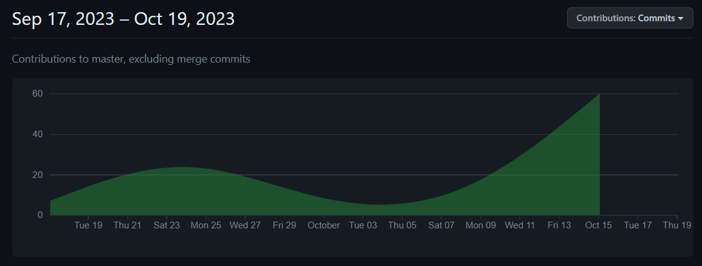
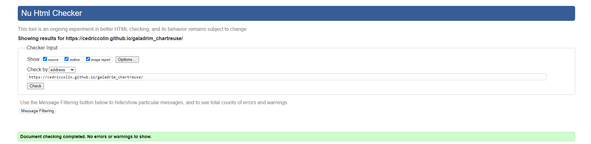
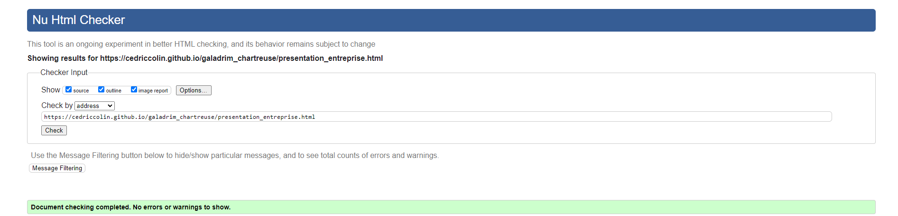
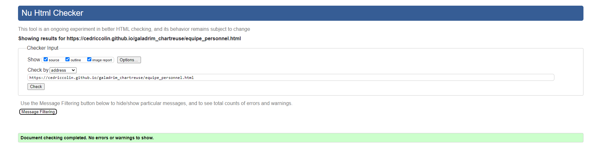
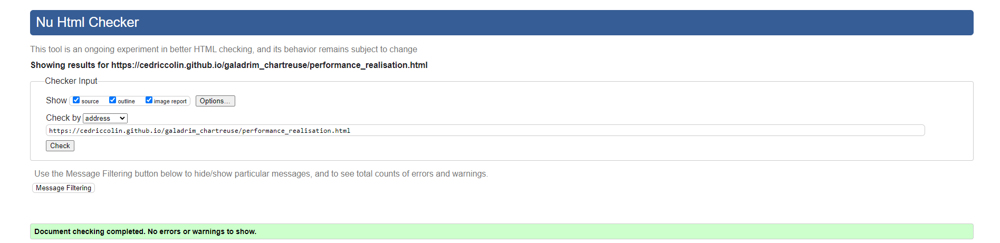
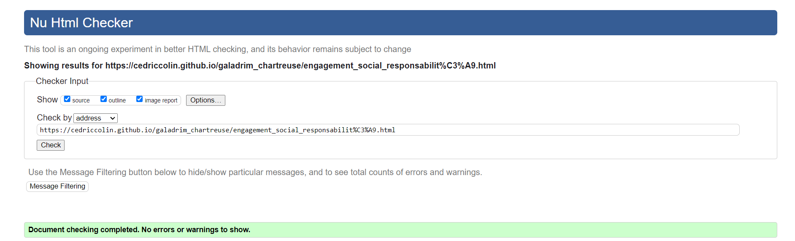

# Sujet de SAE 5 et 6

## Sujet

[Accueil | Team Chartreuse (github.io)](https://cedriccolin.github.io/galadrim_chartreuse/)

[Accueil | Team Chartreuse (gitlab.io)](https://galadrim-chartreuse-cedriccolin-533234ebad0ef47fce28e194b3b878b.gitlab.io/)

## Membres du groupe 

- [Baptiste DULIEUX **(référent du groupe)**](mailto:baptiste.dulieux@edu.univ-fcomte.fr?subject=sae_5_et_6)
- [Marvyn LEVIN](mailto:marvyn.levin@edu.univ-fcomte.fr?subject=sae_5_et_6)
- [Corentin CONTINO](mailto:corentin.contino@edu.univ-fcomte.fr?subject=sae_5_et_6)
- [Simon COMBE](mailto:simon.combe@edu.univ-fcomte.fr?subject=sae_5_et_6)
- [Cédric COLIN](mailto:cedric.colin@edu.univ-fcomte.fr?subject=sae_5_et_6)

# Presentation du projet

Notre projet est de créer un site informatif qui retranscrit tout d’abord Galadrim ; entreprise du
numérique dans le développement de produits digitaux adaptés aux marchés. Dans celui-ci,
nous aurons retranscrit l’histoire de Galadrim depuis sa création jusqu’à son évolution actuelle
par le biais de la présentation de l’entreprise. Mais aussi l’équipe et le personnel à l’aide de
statistiques et d’organigrammes. Et pour finir, nous aurons inscrit les rapports économiques et
d’engagement de l’entreprise Galadrim.
- La Team Chartreuse.

## Choix de conception

### Le site de Cyril Lignac

Le site de Cyril Lignac se distingue par son utilisation efficace des nuances de blanc,
créant une esthétique épurée et professionnelle. Cette approche visuelle peut être adaptée
à notre site pour transmettre une image de clarté, de transparence et de professionnalisme.

De plus, la structure du site est organisée de manière logique, avec une hiérarchie
visuelle claire. Cela facilite la lecture et la navigation pour les visiteurs. En utilisant une
structure similaire, nous pouvons garantir que les informations sur votre site seront
présentées de manière ordonnée et facilement compréhensible.

### Le site de Galadrim
Le site Galadrim adopte un style numérique moderne, avec des éléments visuels tels
que des graphiques dynamiques et des animations subtiles. Cela peut être une source
d'inspiration pour donner à votre site une touche de modernité et de technologie, ce qui
peut être pertinent pour une entreprise du numérique.

Et le choix de couleurs utilisé sur le site créé une palette visuelle distinctive et assez
complète. En adaptant une palette de couleurs unique pour votre site, nous pourrions
renforcer l'identité visuelle de l'entreprise Galadrim.

### Le site d'Anne Sophie kinésiologue
Le site d'Anne Sophie, kinésiologue, présente un pied de page bien structuré avec
des liens utiles vers d'autres pages du site, les coordonnées de contact, et des icônes de
réseaux sociaux. Cette organisation permet aux visiteurs de trouver rapidement des
informations importantes et de naviguer plus facilement sur le site. Nous pourrons intégrer
un pied de page similaire pour améliorer la convivialité de votre site.

De même pour le bouton "Retour en haut de page" qui facilite la navigation pour les
visiteurs, en leur permettant de revenir rapidement en haut de la page sans faire défiler.
Cela peut être une petite amélioration qui rendra la navigation sur notre site plus fluide.

## Contributeurs

## Développement Site Web et Validation des pages

### Page d'accueil

**Auteur : Marvyn LEVIN**

Vérificateur W3C : [Capture d'écran de la conformité de la page...](https://validator.w3.org/nu/?showsource=yes&showoutline=yes&showimagereport=yes&doc=https%3A%2F%2Fcedriccolin.github.io%2Fgaladrim_chartreuse%2F)

### Page "présentation de l'entreprise"

**Auteur : Corentin CONTINO**

Vérificateur W3C : [Capture d'écran de la conformité de la page...](https://validator.w3.org/nu/?showsource=yes&showoutline=yes&showimagereport=yes&doc=https%3A%2F%2Fcedriccolin.github.io%2Fgaladrim_chartreuse%2Fpresentation_entreprise.html)

### Page "équipe et personnel"

**Auteur : Cédric COLIN**

Vérificateur W3C : [Capture d'écran de la conformité de la page...](https://validator.w3.org/nu/?showsource=yes&showoutline=yes&showimagereport=yes&doc=https%3A%2F%2Fcedriccolin.github.io%2Fgaladrim_chartreuse%2Fequipe_personnel.html)

### Page "performances et réalisations"

**Auteur : Simon COMBE**

Vérificateur W3C : [Capture d'écran de la conformité de la page...](https://validator.w3.org/nu/?showsource=yes&showoutline=yes&showimagereport=yes&doc=https%3A%2F%2Fcedriccolin.github.io%2Fgaladrim_chartreuse%2Fperformance_realisation.html)

### Page "Engagement social et responsabilité"

**Auteur : Baptiste DULIEUX**

Vérificateur W3C : [Capture d'écran de la conformité de la page...](https://validator.w3.org/nu/?showsource=yes&showoutline=yes&showimagereport=yes&doc=https%3A%2F%2Fcedriccolin.github.io%2Fgaladrim_chartreuse%2Fengagement_social_responsabilit%25C3%25A9.html)

## Répartition du travail

### Planification - Diagramme de GANTT

- Marvyn LEVIN

### Recherches d'informations

- Simon COMBE
- Cédric COLIN

### Rapport économique

- Simon COMBE
- Marvyn LEVIN
- Baptiste DULIEUX

### Développement site

- Marvyn LEVIN
    - Page d'accueil
- Corentin CONTINO
    - Page présentation de l'entreprise
    - Intégration de la carte Google Map
- Baptiste DULIEUX
    - Page engagement social et responsabilité
- Simon COMBE
    - Page performances et réalisations
- Cédric COLIN
    - Page de l'équipe et du personnel
    - "Template" de page (Navbar/Footer/bouton de retour en haut de page)
    - Modèle 3D + implémentation sur le site

  

SAE de semestre 1 ; compétences 5 et 6. 
Département informatique.
