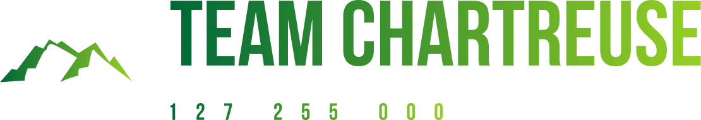
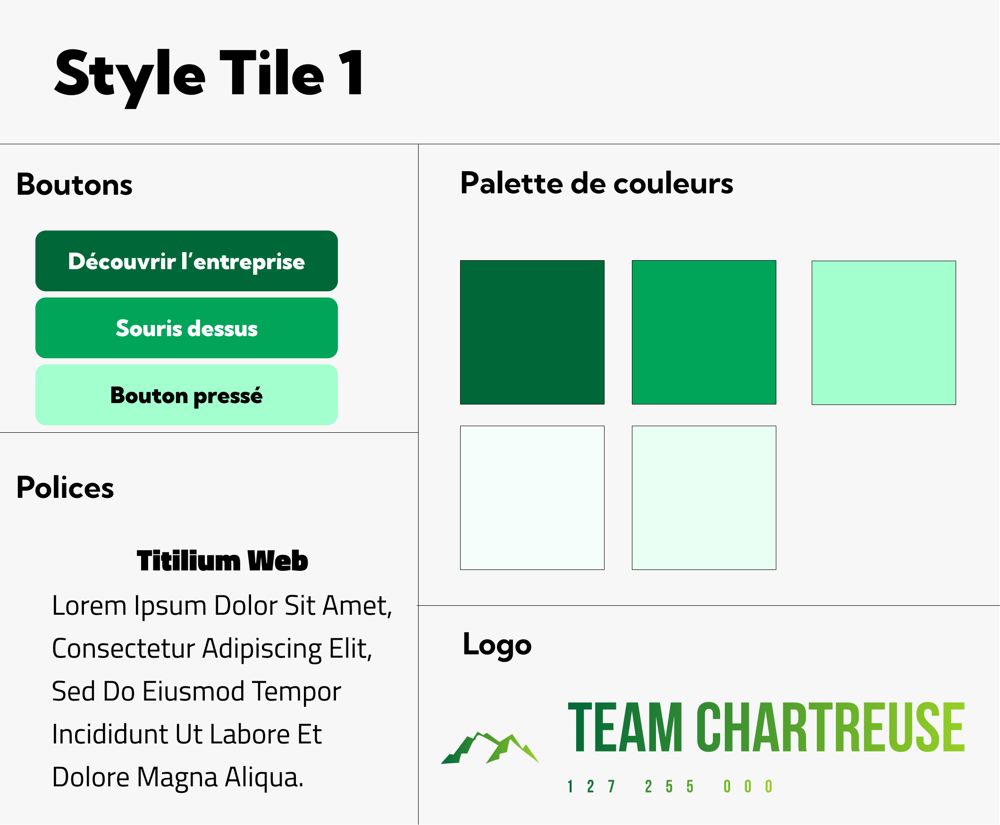

# Équipe Team Chartreuse - Projet BUT Informatique Galadrim - 07/09/2023 19/10/2023


## Informations Équipe
- **Membres** :
  - DULIEUX Baptiste (référent)
  - LEVIN Marvyn
  - CONTINO Corentin
  - COMBE Simon
  - COLIN Cédric
- **Objectif** : Créer un site informatif détaillant l'histoire, les activités, et les engagements de l'entreprise Galadrim.
- **Langages Utilisés** :
  - HTML, CSS, JavaScript
  - Intégration de Google Maps et modèles 3D

## Documents liés au projet
- [Cahier des charges-pdf](./docs/cahierDesChargesTerm.pdf)
- [Soutenance-pdf](./docs/projetHeaven.pdf) [Soutenance-pptx](./docs/projetHeaven.pptx)
- [Logos Team Heaven](./docs/logos/)

## Cahier des Charges

### 1. Présentation du Projet
- **But** : Créer un site web intuitif et informatif pour présenter l'entreprise Galadrim, son équipe, et ses engagements sociaux.
- **Moyens** : Exploitation de différents styles visuels inspirés de sites comme ceux de Cyril Lignac et Galadrim pour allier professionnalisme et modernité.
- **Objectifs du site** :
  - **Présentation de l’entreprise** : Histoire et valeurs
  - **Équipe et personnel** : Statistiques et organigrammes
  - **Performances et réalisations** : Rapports économiques et projets
  - **Engagement social** : Responsabilité sociétale de l'entreprise

### 2. Types de Fichiers
- **Illustrations** : Les illustrations sont réalisées par Freepik, source : [Freepik](https://fr.freepik.com/).

### 3. Recherche Documentaire
- **Ressources** :
  - [Documentation HTML & CSS](https://developer.mozilla.org/fr/)
  - [Validation W3C](https://validator.w3.org/)
  - **Exemples de sites** : Cyril Lignac, Galadrim, site de kinésiologie d'Anne Sophie

### 4. Répartition du Travail
- **Baptiste DULIEUX** :
  - Page "Engagement social et responsabilité"
- **Marvyn LEVIN** :
  - Page d'accueil et vérifications de conformité W3C
- **Corentin CONTINO** :
  - Page présentation de l'entreprise et intégration Google Maps
- **Cédric COLIN** :
  - Page de l'équipe et du personnel, template de pages (Navbar/Footer)
- **Simon COMBE** :
  - Page performances et réalisations, contribution au rapport économique

## Concept Graphique
### Inspirations et Design
- **Esthétique épurée** inspirée du site de Cyril Lignac pour une image professionnelle et moderne


- **Palette de couleurs unique** et éléments dynamiques tirés du style de Galadrim


- **Pied de page structuré** et **bouton de retour en haut** pour faciliter la navigation


## Validation des Pages
- **Page d'accueil** - Auteur : Marvyn LEVIN - [Validation W3C](https://validator.w3.org/nu/?doc=https%3A%2F%2Fcedriccolin.github.io%2Fgaladrim_chartreuse%2F)
- **Présentation de l'entreprise** - Auteur : Corentin CONTINO - [Validation W3C](https://validator.w3.org/nu/?doc=https%3A%2F%2Fcedriccolin.github.io%2Fgaladrim_chartreuse%2Fpresentation_entreprise.html)
- **Équipe et personnel** - Auteur : Cédric COLIN - [Validation W3C](https://validator.w3.org/nu/?doc=https%3A%2F%2Fcedriccolin.github.io%2Fgaladrim_chartreuse%2Fequipe_personnel.html)
- **Performances et réalisations** - Auteur : Simon COMBE - [Validation W3C](https://validator.w3.org/nu/?doc=https%3A%2F%2Fcedriccolin.github.io%2Fgaladrim_chartreuse%2Fperformance_realisation.html)
- **Engagement social** - Auteur : Baptiste DULIEUX - [Validation W3C](https://validator.w3.org/nu/?doc=https%3A%2F%2Fcedriccolin.github.io%2Fgaladrim_chartreuse%2Fengagement_social_responsabilit%25C3%25A9.html)

## Instructions d'Exécution sur Windows

1. **Cloner le dépôt GitHub:**
```shell
git clone <https://github.com/marvynlevin/galadrim.git>
```

Ou, si vous avez un fichier zip à télécharger
```shell
Invoke-WebRequest -Uri <URL_du_fichier> -OutFile ".\projet.zip"
Expand-Archive -Path ".\projet.zip" -DestinationPath ".\MonProjet"
```
2. **Ouvrir la page HTML dans le navigateur par défaut:**

````shell
# Par défault
Start-Process .\MonProjet\index.html

# Pour Chrome
Start-Process "chrome.exe" .\MonProjet\index.html

# Pour Firefox
Start-Process "firefox.exe" .\MonProjet\index.html

# Pour Edge
Start-Process "msedge.exe" .\MonProjet\index.html
```

